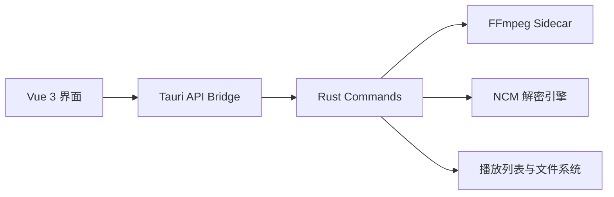

# SyncWave

> 一个轻量、快速、偏实用主义的本地音视频工具箱。  
> 从 Electron 版本重构到 **Tauri 2 + Vue 3 + Rust**，把原本“能用”的桌面媒体工具，变成更轻、更快、更像原生应用的 SyncWave。

<p align="center">
  <b>本地音乐管理</b> · <b>NCM 转换</b> · <b>FFmpeg 视频处理</b> · <b>音频提取</b> · <b>视频转 GIF</b>
</p>

<p align="center">
  
  
  
  
</p>

---

## 项目简介

**SyncWave** 最初是一个基于 Electron 的桌面音视频工具，聚合了 NCM 音乐转换、本地音乐播放、音视频合并、格式转换、视频压缩、视频裁剪、音频提取和视频转 GIF 等常用能力。

当前仓库是对原 Electron 版本的 **Tauri 重构版**：

- 前端保留 Web 技术栈的开发效率，使用 **Vue 3 + Vite** 构建界面。
- 原生能力迁移到 **Rust + Tauri Command**，用于处理文件、播放列表、NCM 解密和 FFmpeg 调度。
- FFmpeg、ffprobe、ffplay、ncmdump、unlock-music 以 sidecar 形式随应用分发，尽量做到开箱即用。

相比 Electron 版本，Tauri 重构后的 SyncWave 更注重：

- 更低的内存占用
- 更快的启动速度
- 更小的运行时负担
- 更清晰的前后端边界
- 更适合作为长期维护的桌面应用架构

---

## 功能特色

### 音乐工具

- **NCM 转换**：支持网易云 NCM 文件转换为常见音频格式，并支持歌词提取相关流程。
- **本地音乐播放器**：内置本地播放能力，支持播放列表管理、切歌、播放模式和歌词显示。
- **歌单管理**：支持创建、重命名、删除、导入、导出和拖拽排序。

### FFmpeg 媒体工作台

- **音视频合并**：将视频轨与音频轨快速合成为新视频。
- **格式转换**：支持常见视频/音频格式之间的转换。
- **音频提取**：从视频文件中单独导出音频。
- **视频裁剪**：按时间区间截取视频片段。
- **视频压缩**：通过 CRF、分辨率等参数控制压缩效果。
- **视频转 GIF**：使用调色板两阶段流程生成更高质量 GIF。

### 桌面体验

- 自定义无边框窗口标题栏
- 拖拽导入文件
- 实时进度条与日志输出
- 暗色系媒体工具界面
- 一个不太正经的隐藏彩蛋页面

---

## 为什么从 Electron 迁移到 Tauri？

原 Electron 版本已经实现了完整功能，但 Electron 的运行时体积和资源占用对于这类本地工具来说偏重。SyncWave 的 Tauri 重构将核心任务拆分为：



这种架构让界面层保持灵活，原生层负责性能敏感和系统相关的工作，整体更适合桌面端长期迭代。

---

## 技术栈

| 层级 | 技术 |
| --- | --- |
| 桌面框架 | Tauri 2 |
| 前端框架 | Vue 3 |
| 构建工具 | Vite 6 |
| 原生层 | Rust |
| 媒体处理 | FFmpeg / ffprobe / ffplay |
| 音乐解锁辅助 | ncmdump / unlock-music |
| 打包目标 | NSIS / MSI |

---

## 项目结构

```text
SyncWave-Tauri/
├─ src/                      # Vue 前端代码
│  ├─ components/             # 通用组件：拖拽区、进度条、日志面板等
│  ├─ pages/                  # 功能页面：NCM、播放器、转码、压缩等
│  ├─ composables/            # 复用逻辑
│  ├─ styles/                 # 页面与组件样式
│  └─ utils/                  # Tauri API、图标、格式化工具
├─ src-tauri/                 # Tauri / Rust 原生层
│  ├─ src/
│  │  ├─ ffmpeg.rs            # FFmpeg sidecar 调度
│  │  ├─ ncm.rs               # NCM 解密与转换逻辑
│  │  ├─ playlist.rs          # 播放列表管理
│  │  ├─ lib.rs               # Tauri 命令注册
│  │  └─ main.rs              # 应用入口
│  ├─ binaries/               # 外部二进制 sidecar
│  └─ tauri.conf.json         # Tauri 应用与打包配置
├─ package.json
└─ vite.config.js
```

---

## 快速开始

### 环境要求

- Node.js
- Rust toolchain
- Tauri 2 所需平台依赖
- Windows 打包时建议安装 Visual Studio Build Tools / WebView2 相关依赖

### 安装依赖

```bash
npm install
```

### 前端开发预览

```bash
npm run dev
```

### 启动 Tauri 开发模式

```bash
npm run tauri -- dev
```

### 构建前端

```bash
npm run build
```

### 打包桌面应用

```bash
npm run tauri -- build
```

打包产物默认生成在 `src-tauri/target/release/bundle/` 下。

---

## 应用配置

当前 Tauri 配置位于 `src-tauri/tauri.conf.json`：

- 产品名：`SyncWave`
- 应用标识：`com.tangkuku.SyncWave`
- 窗口尺寸：`1000 x 700`
- 最小窗口：`800 x 600`
- 窗口样式：无系统边框，自定义标题栏
- Windows 打包：支持 `NSIS` 和 `MSI`
- 外部二进制：`ffmpeg`、`ffprobe`、`ffplay`、`ncmdump`、`unlock-music`

---

## 适用场景

SyncWave 更像是一个面向个人使用的“媒体处理小工作台”：

- 想把下载的音乐文件整理成本地歌单
- 想快速从视频里提取音频
- 想把视频压缩后发给别人
- 想把一小段视频转成 GIF
- 想合并一条视频和另一条音频
- 想要一个比命令行更直观的 FFmpeg 图形界面

---

## 迁移状态

- [x] Electron 主进程能力迁移到 Rust Commands
- [x] Vue 3 页面组件化重构
- [x] FFmpeg sidecar 集成
- [x] NCM 处理逻辑迁移
- [x] 播放列表持久化
- [x] Windows NSIS / MSI 打包
- [ ] 更多平台适配与测试
- [ ] 更完善的截图、演示 GIF 与 Release 文档

---

## 说明

本项目主要用于个人学习、桌面应用重构实践与本地媒体处理。涉及的第三方工具与格式处理能力请遵循对应项目协议与当地法律法规，仅用于处理你有权使用的本地文件。

---

## License

请查看仓库中的 `LICENSE` 文件。
